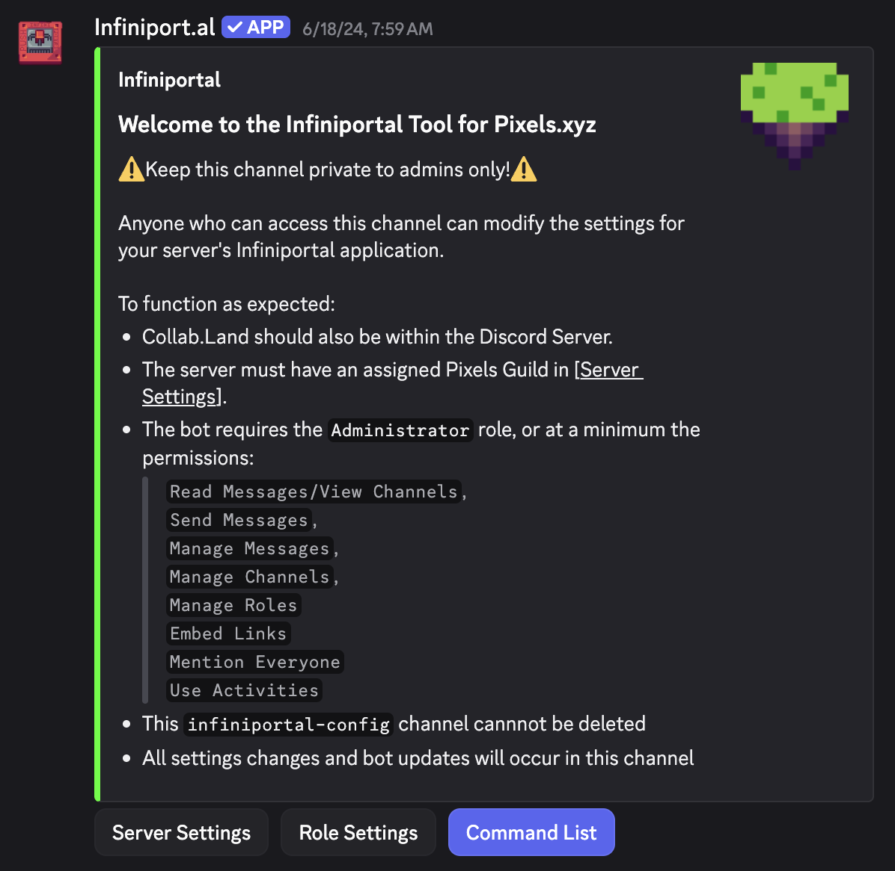
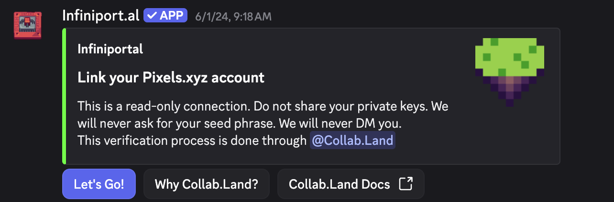
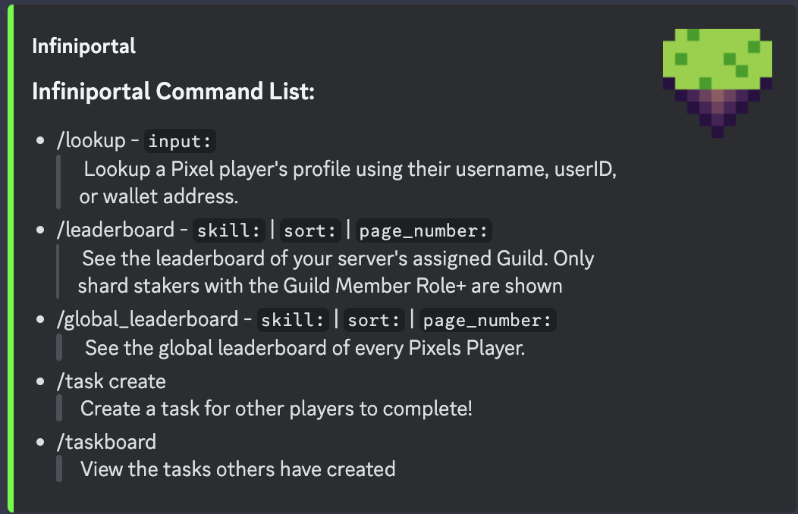
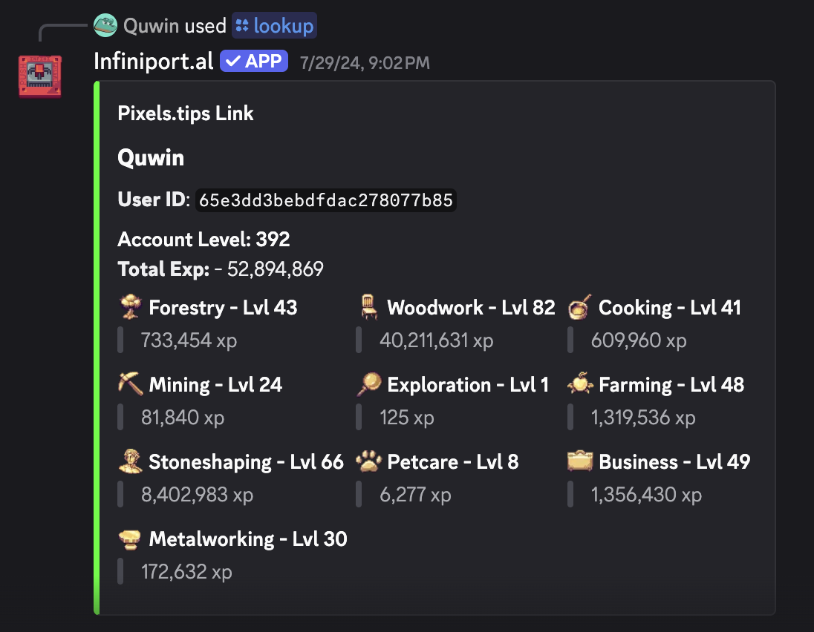
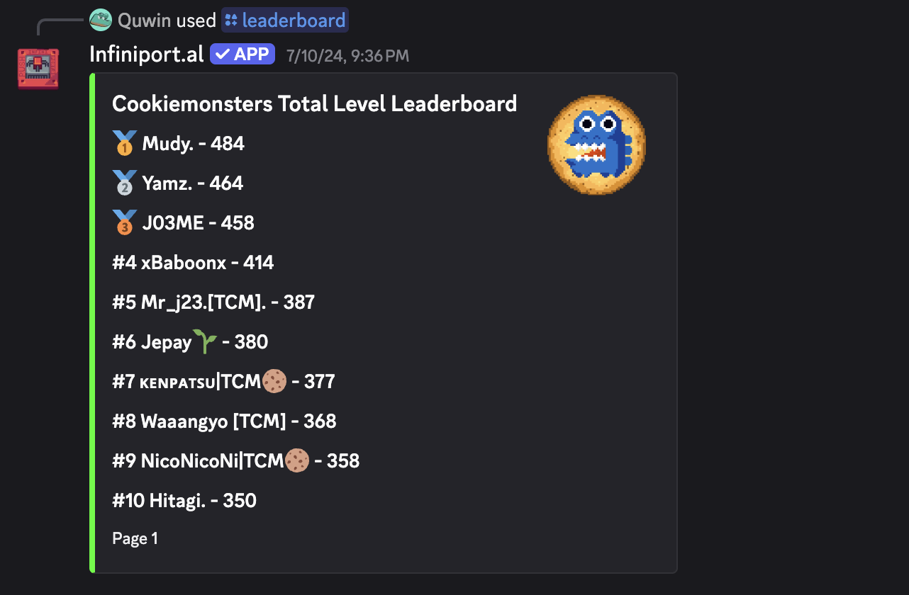
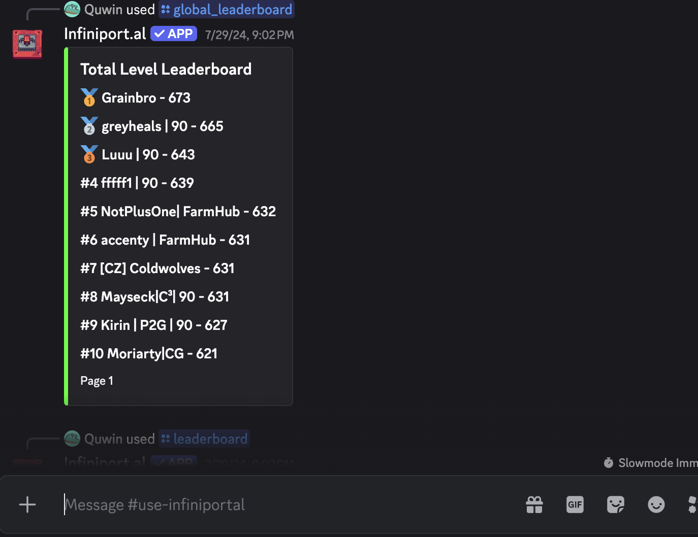
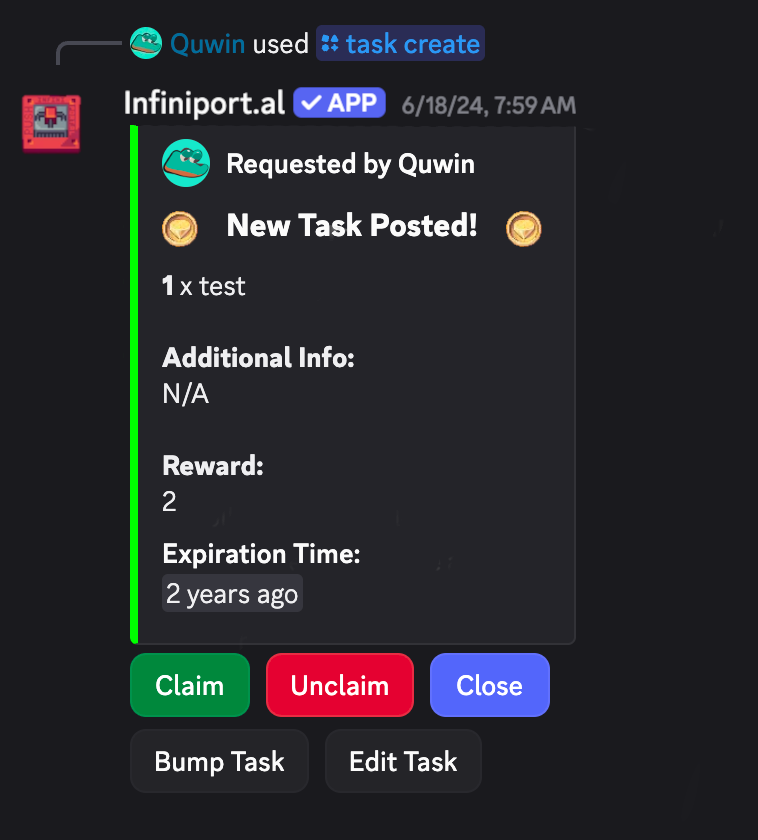

# Infiniport.al
~~https://infiniport.al~~ Currently archived

Infiniportal is a Pixels.xyz Profile viewer and Community Management tool, available as both a website and a Discord App.
As a community tool, usage is primarily focused on the Discord Application, with the website for offline lookups only. 

The Infiniportal Discord App also includes features such as Guild-based Discord Server Management, Local Guild Leaderboards, and Player-created Tasks for other members to fulfill. 

## Usage
The Discord App can be added through:

~~https://discord.com/oauth2/authorize?client_id=1233991850470277130&scope=bot&permissions=1342598160~~ Currently archived

For proper usage, the Infiniport.al Discord bot requires at least the following permissions:
- `Read Messages / View Channels`
- `Send Messages`
- `Manage Messages`
- `Manage Channels`
- `Manage Roles`
- `Embed Links`
- `Mention Everyone`
- `Use Activities`
  
Failure to provide the necessary permissions will result in errors in usage, with the removal and re-addition of the bot as the necessary resolution.

Upon addition to a Discord Server, Infiniport.al will automatically create an `#infiniportal-config` channel, with the following message:

From there, setting the Server's guild is possible, for the local `/leaderboard` command, as well as Role Management settings and other information. 

## Account Linking
In order for Pixels.xyz accounts to be linked to Discord accounts for Role Management, the Collab.Land API is used.

Users must have access to the crypto wallet used for their Pixels.xyz account, and will sign a read-only transaction linking their accounts. 

This is reversable at any time, and secured by the Collab.Land API.

Example:

## Commands

The general list of commands can be seen here, with usage tied to Discord's Command System:

Examples of the commands can be seen here:

